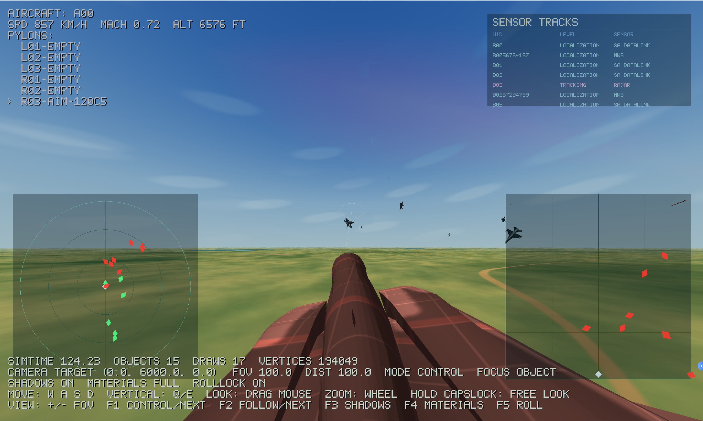

# BVR Sim

<p align="center">
  <strong>面向多智能体强化学习的 3D 超视距空战仿真环境</strong>
</p>

<p align="center">
  <a href="https://www.bilibili.com/video/BV115SvBaEGn">演示视频</a>
  ·
  <a href="docs/getting_started.md">快速开始</a>
  ·
  <a href="docs/configuration.md">配置说明</a>
  ·
  <a href="docs/integration.md">RL 集成</a>
</p>

<p align="center">
  
  
  
  
</p>

<p align="center">
  
</p>

`bvr-sim` 是一个面向多智能体强化学习的 3D 超视距空战仿真环境，提供两套后端：

- 纯 Python 环境，便于调试和快速验证
- C++ + Python 混合环境，便于更高性能训练和扩展

## 核心能力

- 基于 JSBSim 的六自由度飞行动力学模型
- 空空导弹与地面防空单位仿真
- 支持 `AIM-120C`、`AIM-9M` 与参数化定制导弹
- 支持标准大气模型和可配置交战场景
- 多种 observation space
- 可配置 reward shaping
- 基于 ACMI 的 Tacview 回放输出
- 规则对手与外部 RL 框架适配入口

## 仓库结构

```text
bvr_sim/               Python 包与 C++ 核心源码
  src_py/              Python 仿真、奖励、规则对手
  src_cxx/             C++ 仿真核心
  build_windows.bat    Windows 构建脚本
  build_linux.sh       Linux 构建脚本
tests/                 smoke tests、unit tests
benchmarks/            标准 benchmark 脚本与 1v1-10v10 配置
rl_envs/               正式外部 RL 框架适配入口
experimental/          实验性脚本与 JSON/JSONC 配置
docs/                  研究材料与补充文档
```

## 环境要求

- Python 3.8+
- Windows 或 Linux
- `git`
- C++ 后端构建需要 `cmake` 和本地 C++ 编译器
  - Windows: 建议使用 Visual Studio / MSVC
  - Linux: 建议使用 `gcc` 或 `clang`

Python 依赖定义在 [`pyproject.toml`](pyproject.toml) 中，核心依赖包括：

- `numpy`
- `scipy`
- `gymnasium`
- `opencv-python`
- `commentjson`
- `JSBSim==1.1.14`

## 快速开始

### 1. 安装 Python 包

在仓库根目录执行：

```bash
pip install -e .
```

这会安装 Python 版本环境所需依赖，并以 editable mode 暴露 `bvr_sim` 包。

如果你想验证当前仓库的 Python 打包路径，也可以执行：

```bash
python -m pip install build
python -m build --wheel
```

生成的 wheel 会出现在 `dist/` 下。当前 `pyproject.toml` 使用 `scikit-build-core`，wheel 会尝试同时构建 `bvr_sim_cpp` 原生扩展。

### 安装后的运行时资源

从当前版本开始，`bvr-sim` 的运行时资源已经统一收敛到包内目录：

```text
bvr_sim/resources/
  jsbsim/
  missile/mmodelA/
```

其中：

- `bvr_sim/resources/jsbsim/` 保存 JSBSim 所需的 XML 机型、发动机和系统定义
- `bvr_sim/resources/missile/mmodelA/` 保存 C++ `MModelA` 的 JSON 参数文件

这意味着：

- `pip install bvr-sim` 后，Python 环境和 C++ 环境都会默认从已安装包内的 `bvr_sim/resources/` 查找资源
- 运行时不再依赖源码目录 `bvr_sim/src_cxx/simulator/aircraft/fdm/jsbsim/`

如果你需要覆盖默认资源目录，可以设置环境变量：

```bash
export BVR_SIM_RESOURCE_DIR=/path/to/custom/resources
```

Windows PowerShell:

```powershell
$env:BVR_SIM_RESOURCE_DIR="C:\path\to\custom\resources"
```

如果你只想单独覆盖 JSBSim 资源目录，可以设置：

```bash
export JSBSIM_DIR=/path/to/custom/jsbsim
```

默认查找顺序是：

1. `BVR_SIM_RESOURCE_DIR` 指向的资源根目录
2. 已安装包内的 `bvr_sim/resources`

对 JSBSim 来说，还会优先尊重单独设置的 `JSBSIM_DIR`。

### 2. 运行纯 Python smoke test

```bash
python tests/test_py.py
```

这个脚本会：

- 加载 [`tests/demo_config.json`](tests/demo_config.json)
- 创建 [`BVR3DEnv`](bvr_sim/bvr_env.py)
- 在 `test_logs/` 下输出 ACMI 回放

如果你只是第一次体验项目，建议先跑这一步。

### 3. 构建 C++ 后端

Windows:

```powershell
bvr_sim\build_windows.bat
```

Linux:

```bash
bash bvr_sim/build_linux.sh
```

构建脚本会自动拉取 C++ 依赖到 `bvr_sim/src_cxx/extern/`，然后生成并安装原生库到 `bvr_sim/install/`。

### 4. 运行 C++ smoke test

```bash
python tests/test_cpp.py
```

这个脚本会：

- 加载 [`tests/demo_config_cpp.jsonc`](tests/demo_config_cpp.jsonc)
- 创建 [`BVR3DEnvCpp`](bvr_sim/bvr_env_cpp.py)
- 在 `test_logs/` 下输出日志与 ACMI 回放

### 5. 运行完整测试

```bash
python run_tests.py
```

该脚本会依次执行：

1. 重建 C++ 后端
2. 安装当前包
3. 运行 `bvr_sim_unit_tests`
4. 运行 `test_c3utils`
5. 运行 C++ smoke test
6. 运行 Python smoke test

## 最小使用示例

### 纯 Python 环境

```python
import json
from bvr_sim import BVR3DEnv

with open("tests/demo_config.json", "r", encoding="utf-8") as f:
    config = json.load(f)

env = BVR3DEnv(config, logdir="./test_logs")
obs, info = env.reset()

done = False
while not done:
    obs, reward, dones, info = env.step({})
    done = info["episode_done"]
```

### C++ 环境

```python
import commentjson
from bvr_sim import BVR3DEnvCpp

with open("tests/demo_config_cpp.jsonc", "r", encoding="utf-8") as f:
    config = commentjson.load(f)

env = BVR3DEnvCpp(config, rl_index=[], log_file_path="./test_logs/bvr_sim.log")
obs, info = env.reset()

done = False
while not done:
    obs, reward, dones, info = env.step({})
    done = info["episode_done"]
```

说明：

- Python 环境里，传入 `{}` 时红方会退回默认 baseline 行为
- C++ 环境里，`rl_index=[]` 表示没有 RL 控制单元，环境可作为纯规则推演运行

## 配置说明

示例配置见：

- [`tests/demo_config.json`](tests/demo_config.json)
- [`tests/demo_config_cpp.jsonc`](tests/demo_config_cpp.jsonc)
- [`experimental/custom_5v5_f22_f16.jsonc`](experimental/custom_5v5_f22_f16.jsonc)

常见字段：

- `dt`: 仿真步长
- `max_steps`: 单局最大步数
- `red_fighters` / `blue_fighters`: Python 环境的红蓝方飞机定义
- `red_meta` / `blue_meta`: C++ 环境的红蓝方单元定义
- `ground_units`: 地面单位配置
- `obs_type`: 观测空间类型，当前代码支持 `compact`、`extended`、`shadow`、`canvas`、`lidar`、`entity`、`text`
- `blue_opponent_type`: 蓝方规则对手类型；设为 `null` 时可改成双边可控
- `reward_config`: 奖励项权重
- `pylon_mounts`: C++ 单位挂点与武器配置，当前仓库样例已使用 `AIM-120C7` 和 `AIM-9M`
- `opponent_type`: 单机规则对手类型，当前样例常见值为 `tactical` 和 `standoff`
- `initial_separation_nm`: 初始交战距离
- `formation_max_spread_nm`: 编队横向散布

关于运行时资源：

- `fdm_type: "jsbsim"` 时，Python 和 C++ 仿真核心都会从 `bvr_sim/resources/jsbsim/` 加载 XML
- C++ `MModelA` 会从 `bvr_sim/resources/missile/mmodelA/` 加载导弹参数 JSON

关于最近新增能力：

- `AIM-9M` 已可直接写入 C++ 配置的 `pylon_mounts`
- `tactical` 对手会在合适距离尝试使用 `AIM-9M`
- `standoff` 对手会优先控制距离，具备 approach / AIM-120 发射后 crank / support / defensive abort / orbit 等行为切换
- `MModelA` 内部新增 `enable_INS_guide` 开关；这是导弹模型参数，不是顶层环境配置项

## 输出结果

默认运行后你会看到：

- `test_logs/*.acmi`: 可用 Tacview 打开回放
- `test_logs/bvr_sim.log`: C++ 后端运行日志
- `bvr_sim/install/`: 原生构建产物

不要手工编辑以下生成目录：

- `bvr_sim/build/`
- `bvr_sim/install/`
- `benchmark_logs/`
- `test_logs/`

## 最近更新

- 新增 game mode / DX11 可视化，支持 HUD、态势显示、雷达画面和键盘镜头控制。
- 改进地形与道路渲染，空战场景的空间感和可读性更好。
- 增强传感器与目标跟踪能力，便于观察交战态势变化。
- 整理 benchmark 与 5v5 示例场景，方便从单机对抗扩展到编队推演。

## 与外部框架集成

仓库中已经有一些适配入口或示例：

- [`rl_envs/env_wrapper.py`](rl_envs/env_wrapper.py)
- [`rl_envs/env_harl.py`](rl_envs/env_harl.py)
- [`rl_envs/env_marlbenchmark.py`](rl_envs/env_marlbenchmark.py)
- [`experimental/run_custom_5v5_acmi.py`](experimental/run_custom_5v5_acmi.py)

其中 [`rl_envs/env_wrapper.py`](rl_envs/env_wrapper.py) 展示了如何把环境包装成外部 MARL 框架可用的接口。
如果你想直接看一个较新的 C++ 推演样例，可以先运行 [`experimental/run_custom_5v5_acmi.py`](experimental/run_custom_5v5_acmi.py)。

## 文档导航

如果你是第一次试用，建议按这个顺序看：

1. 本页 README
2. [`docs/getting_started.md`](docs/getting_started.md)
3. [`docs/installation.md`](docs/installation.md)
4. [`docs/configuration.md`](docs/configuration.md)
5. [`docs/integration.md`](docs/integration.md)
6. [`tests/demo_config.json`](tests/demo_config.json) 或 [`tests/demo_config_cpp.jsonc`](tests/demo_config_cpp.jsonc)
7. [`rl_envs/env_wrapper.py`](rl_envs/env_wrapper.py)

已有研究/设计材料：

- [`docs/doc.md`](docs/doc.md)
- `docs/*.md`
- `docs/*.tex`

这些材料更偏研究记录，不是首次上手文档。

## 常见问题

### `bvr_sim_cpp` 无法导入

先确认你已经执行过 C++ 构建脚本，并且 `bvr_sim/install/lib/` 下已经生成对应动态库。

### 运行 C++ 测试时报找不到 unit test 可执行文件

先构建原生后端，再执行：

```bash
python tests/cpp_unit_tests.py
```

该脚本默认运行 `bvr_sim/install/bin/bvr_sim_unit_tests(.exe)`。
如果你在排查底层数学/工具库，也可以直接运行 `python run_tests.py`，它也会额外执行 `test_c3utils`。

### Tacview 没有回放文件

确认测试或脚本是否显式启用了 render，输出通常在 `test_logs/` 下。

## 开发者文档

如果你要改环境逻辑，而不是只做试用：

- [`docs/developer/architecture.md`](docs/developer/architecture.md)

## 实时可视化

当前仓库包含三条实时可视化路径，均基于 C++ `SimCore` 的实时状态，不包含录像回放链路：

- Web 可视化：`EmbeddedWebServer` + `bvr_sim/web/` 前端
- 原生 OpenGL viewer：调试用抽象战场视图
- 原生 BVR Sim Game Mode（DX11 后端）：当前原生游戏模式方向

三者都和 `bvr_sim_cpp` 一起编译到同一个原生模块中。当前确定不新增独立 `game_app.exe`，DX11 方向也继续使用进程内 viewer / 单一 `pyd` 架构。

### 设计边界

- `SimCore` 负责仿真
- `TelemetryBridge` 在独立线程采样状态
- 状态提取仍然来自对象 `Register`
- `EmbeddedWebServer`、`OpenGLViewer`、`GameMode` 只消费 `WorldSnapshot`
- 原生窗口和浏览器输入仍然转成 telemetry 命令，不直接改仿真对象

这意味着渲染和仿真保持解耦。后续如果扩展对象级调试命令，也应该继续沿着寄存器 / 命令邮箱模式推进。

### 当前状态

- Web 可视化支持 HTTP / WebSocket、HUD / Inspector / Diagnostics、对象筛选和调试命令回执
- OpenGL viewer 优先支持 Windows，Linux / 其他平台当前只保证编译通过，运行时会返回 unsupported
- GameMode 优先支持 Windows，使用 Win32 + Direct3D 11
- GameMode 当前包含基础相机、HUD、天空、地面、网格、飞机 / 导弹 / 地面单位渲染、OBJ mesh 加载和 primitive fallback

### BVR Sim Game Mode 启动步骤

1. 先构建原生扩展

Windows:

```powershell
bvr_sim\build_windows.bat
```

2. 运行 DX11 示例

```bash
python experimental/run_dx11_viz.py
```

3. 或者直接从 Python 调用

```python
from bvr_sim import bvr_sim_cpp

core = bvr_sim_cpp.SimCore(
    dt=0.2,
    log_file_path="./test_logs/dx11.log",
    acmi_file_path=""
)

core.start_telemetry_bridge()
core.start_game_mode()
core.start()
```

### BVR Sim Game Mode Python 接口

- `core.start_game_mode()`
- `core.stop_game_mode()`
- `core.is_game_mode_running()`
- `core.is_game_mode_supported()`
- `core.get_game_mode_status()`

### OpenGL Viewer 启动步骤

1. 运行示例

```bash
python experimental/run_opengl_viz.py
```

2. 或者直接从 Python 调用

```python
from bvr_sim import bvr_sim_cpp

core = bvr_sim_cpp.SimCore(
    dt=0.2,
    log_file_path="./test_logs/opengl.log",
    acmi_file_path=""
)

core.start_telemetry_bridge()
core.start_opengl_viewer()
core.start()
```

### OpenGL Viewer 当前能力

- 原生 OpenGL 窗口
- 飞机 / 导弹 / 地面对象占位渲染
- 跟随 `TelemetryBridge` 最新快照
- `Space` 暂停 / 继续
- `N` 单步
- 方向键旋转相机
- `+` / `-` 缩放

### OpenGL Viewer Python 接口

- `core.start_opengl_viewer()`
- `core.stop_opengl_viewer()`
- `core.is_opengl_viewer_running()`
- `core.is_opengl_viewer_supported()`
- `core.get_opengl_viewer_status()`

### Web 可视化启动步骤

1. 先构建原生扩展

Windows:

```powershell
bvr_sim\build_windows.bat
```

Linux:

```bash
bash bvr_sim/build_linux.sh
```

2. 安装前端依赖

```bash
npm --prefix bvr_sim/web install
```

3. 启动仿真和可视化服务

```python
from bvr_sim import bvr_sim_cpp

core = bvr_sim_cpp.SimCore(
    dt=0.2,
    log_file_path="./test_logs/telemetry.log",
    acmi_file_path=""
)

core.set_visualization_static_root("./bvr_sim/web/dist")
core.start_telemetry_bridge()
core.start_visualization_server(8765)
core.start()
```

如果 `./bvr_sim/web/dist` 已存在，内嵌服务器会直接托管打包后的前端，浏览器可以直接访问：

```text
http://127.0.0.1:8765/
```

4. 启动前端开发服务器

```bash
npm --prefix bvr_sim/web run dev -- --host 127.0.0.1 --port 5173
```

5. 如果你需要前端热更新，浏览器打开：

```text
http://127.0.0.1:5173/?server=http://127.0.0.1:8765
```

### 当前能力

- Three.js 实时场景
- 飞机 / 导弹 / 地面对象占位渲染
- HUD / Inspector / Diagnostics 面板
- `pause` / `resume` / `step`
- 焦点选择
- `set_subscription_filter` 对象筛选
- `object_debug` 对象寄存器写入命令
- `last_command_result` 调试命令回执诊断

### 验证命令

```bash
python tests/cpp_unit_tests.py
python tests/test_web_bridge_smoke.py
npm --prefix bvr_sim/web run build
```

## 许可证

主项目按 GNU General Public License v3.0 发布，官方文本见 [`LICENSE`](LICENSE)。

第三方依赖和内置资源的许可证摘要见 [`docs/legal/THIRD_PARTY_LICENSES.md`](docs/legal/THIRD_PARTY_LICENSES.md)。其中 JSBSim、Eigen、pybind11、cpptrace 等组件保留其原始许可证和版权声明。


