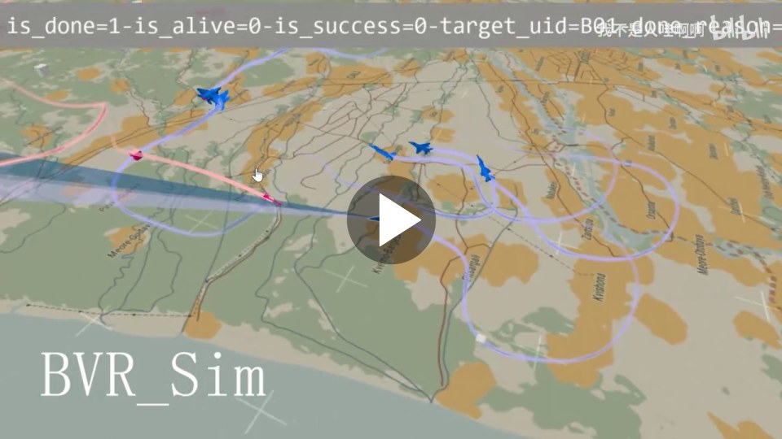
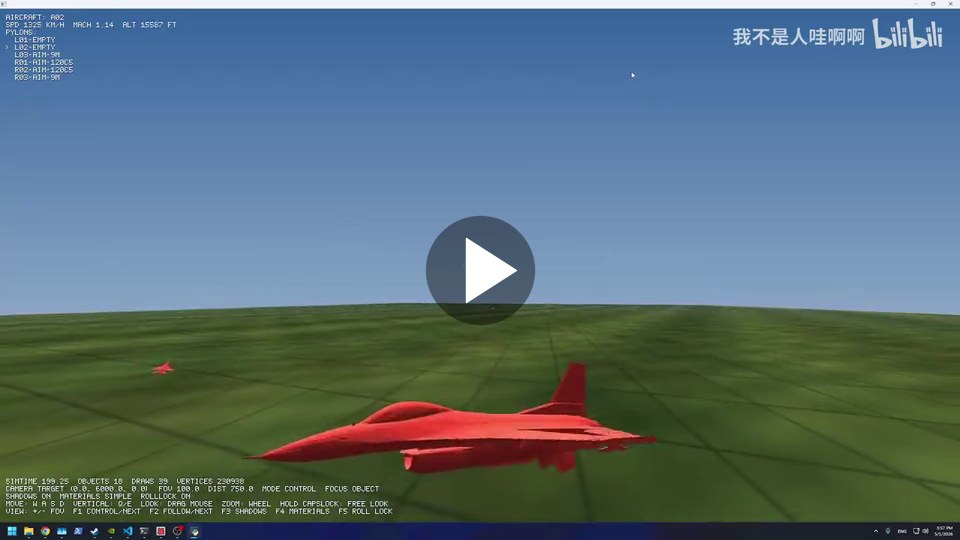
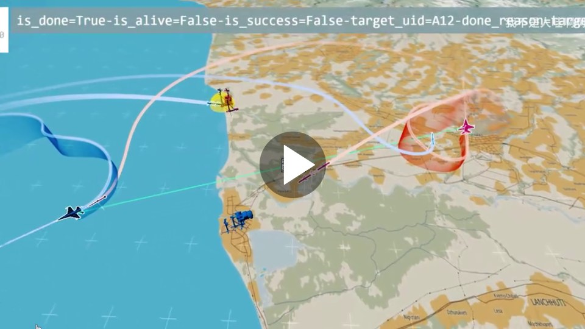
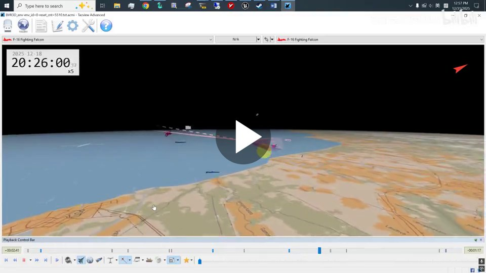
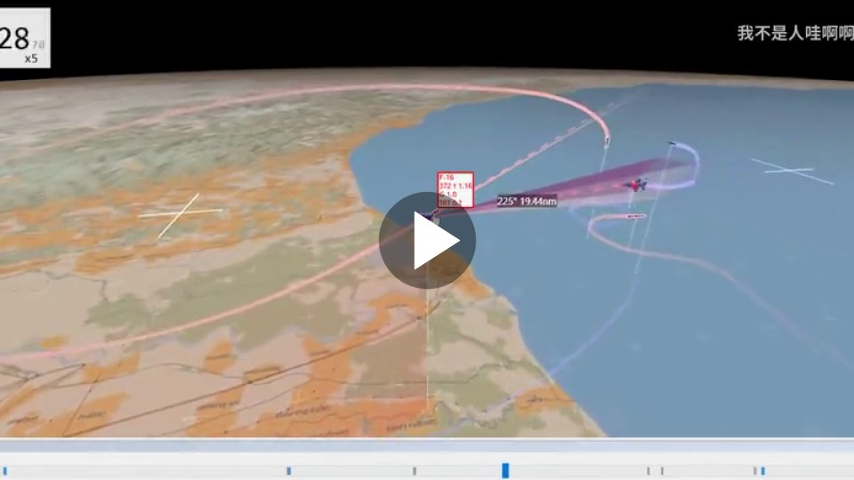
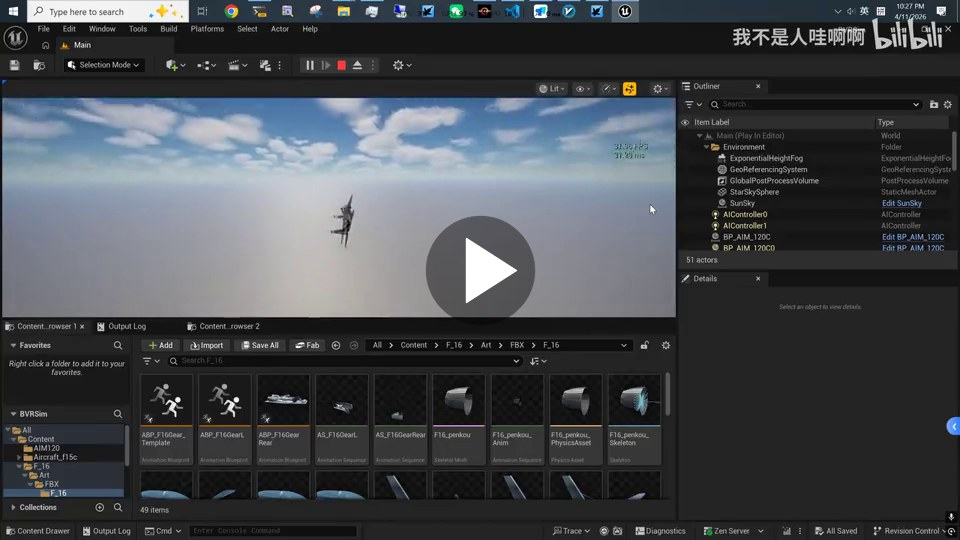
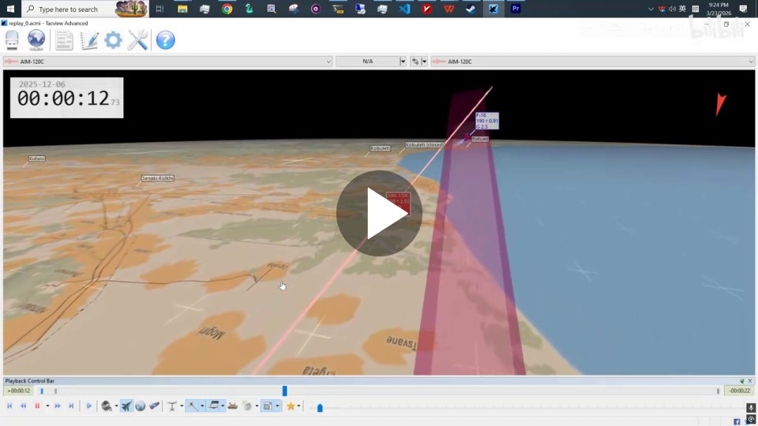
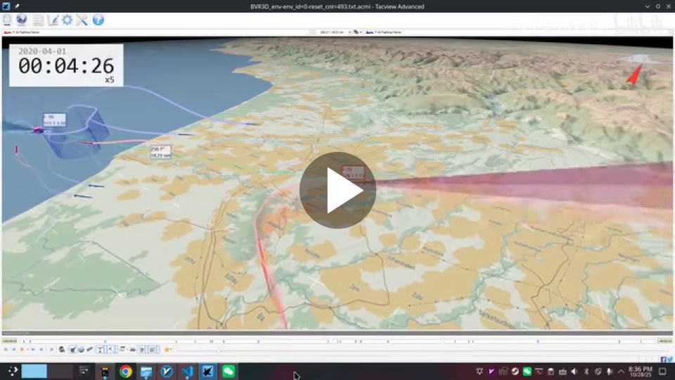
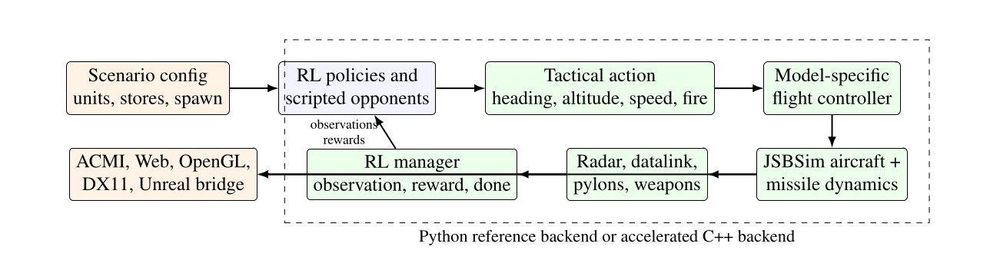
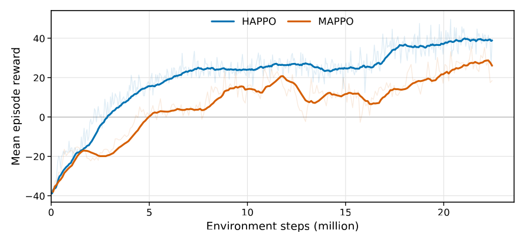

<h2 align="center"><em>BVR Sim</em>: A Fast RL Environment for Heterogeneous Air-Combat</h2>

<p align="center"><sub><a href="README.md">English</a> | 简体中文</sub></p>

<p align="center">
  
  
  
  
  
</p>

`bvr-sim` 是一个面向强化学习研究与工程验证的 3D 超视距空战仿真环境。项目提供纯 Python 后端和 C++ 加速后端，并内置一个轻量 `skrl` PPO 训练入口，使用户可以在安装后直接跑通空战强化学习训练流程。

<div align="center">

| F-22/F-16 异构 6v6 | 人类–AI 实时空战 | 空战 + 地面防空异构强化学习 |
|:---:|:---:|:---:|
| <a href="https://cdn.jsdelivr.net/gh/lizi-Margin/bvr_sim@master/media/demos/f22-f16-heterogeneous-6v6.mp4"></a> | <a href="https://cdn.jsdelivr.net/gh/lizi-Margin/bvr_sim@master/media/demos/human-ai-realtime-air-combat.mp4"></a> | <a href="https://cdn.jsdelivr.net/gh/lizi-Margin/bvr_sim@master/media/demos/heterogeneous-air-ground-rl.mp4"></a> |

| 调优 IPPO：2v2 | 调优 PPO：1v1 | UnrealCV + UE5 实时渲染 |
|:---:|:---:|:---:|
| <a href="https://cdn.jsdelivr.net/gh/lizi-Margin/bvr_sim@master/media/demos/ippo-2v2.mp4"></a> | <a href="https://cdn.jsdelivr.net/gh/lizi-Margin/bvr_sim@master/media/demos/ppo-1v1.mp4"></a> | <a href="https://cdn.jsdelivr.net/gh/lizi-Margin/bvr_sim@master/media/demos/unrealcv-ue5-realtime-rendering.mp4"></a> |

| 复合导弹制导 + FDM | 简化 FDM 强化学习 | |
|:---:|:---:|:---:|
| <a href="https://cdn.jsdelivr.net/gh/lizi-Margin/bvr_sim@master/media/demos/missile-composite-guidance-fdm.mp4"></a> | <a href="https://cdn.jsdelivr.net/gh/lizi-Margin/bvr_sim@master/media/demos/simple-fdm-rl.mp4"></a> | |

</div>

<p align="center">
  
</p>

## 系统架构

<p align="center">
  
</p>

统一战术接口将航向、高度、速度和开火指令映射到各机型专用的内环控制器。仿真、学习接口以及可选的遥测和渲染相互解耦，使同一场景可以使用 Python 参考后端或加速 C++ 后端运行。

## 支持的飞机

C++ JSBSim 后端目前支持以下飞机系列的模型映射：

- F-15
- F-16
- F/A-18
- F-22
- F-4N Phantom II
- AJ 37 和 JA 37 Viggen

同一场景中可以同时配置不同的飞机模型、控制器参数、传感器和武器挂载。

## 环境能力对比

下表复现论文 Table 1，对比所引用公开版本的能力。叉号表示未在相应公开版本中找到文档说明或直接支持。

<div align="center">

| 能力 | BVR Gym | LAG | B-ACE | BVR Sim |
|:---|:---:|:---:|:---:|:---:|
| 开源 | ✓ | ✓ | ✓ | ✓ |
| JSBSim 飞机动力学 | ✓ | ✓ | × | ✓ |
| BVR 级导弹交战 | ✓ | × | ✓ | ✓ |
| 单场景混合多种飞机模型 | × | × | × | ✓ |
| 内置机动与开火接口 | 仅机动 | ✓ | ✓ | ✓ |
| 可互换的 Python/原生 C++ 后端 | × | × | × | ✓ |
| 统一定宽实体表 | × | × | × | ✓ |
| 规则基线与自博弈 | ✓ | ✓ | ✓ | ✓ |
| ACMI/Tacview 导出或遥测 | ✓ | ✓ | × | ✓ |
| 实时 3D 可视化 | FlightGear | Tacview | Godot | 原生查看器 |

</div>

## 性能与 MARL 验证

论文 Table 3 给出了决策间隔为 0.4 秒时的无渲染吞吐量。结果为三次重复的均值 ± 标准差；实时因子（RTF）等于模拟时间除以墙钟时间。

<div align="center">

| 规模 | Python steps/s | C++ steps/s | C++ RTF | 加速比 |
|:---:|---:|---:|---:|---:|
| 1v1 | 95.84 ± 8.07 | 260.65 ± 2.75 | 104.26 | 2.72× |
| 2v2 | 51.01 ± 8.09 | 143.58 ± 4.56 | 57.43 | 2.81× |
| 4v4 | 22.43 ± 3.30 | 88.36 ± 16.56 | 35.34 | 3.94× |
| 6v6 | 13.07 ± 1.18 | 51.21 ± 12.33 | 20.48 | 3.92× |
| 8v8 | 9.63 ± 1.24 | 42.01 ± 12.06 | 16.80 | 4.36× |
| 10v10 | 8.46 ± 1.61 | 55.43 ± 38.71 | 22.17 | 6.55× |

</div>

<p align="center">
  
</p>

上图复现论文 Fig. 3，展示归档的 HAPPO 和 MAPPO 训练曲线，并验证两种算法在同一个 2v2 BVR 任务上的端到端集成。每条曲线仅来自一次运行，因此该图用于集成验证，而不是算法排名。

## 核心能力

- 基于 JSBSim 的飞行动力学建模
- 空空导弹、挂载、发射和交战结果仿真
- 可配置红蓝双方、初始态、武器、规则对手和奖励项
- Gymnasium 风格 observation/action space
- 纯 Python 后端，便于理解、调试和快速验证
- C++ 后端，适合性能要求更高的训练和仿真
- Tacview `.acmi` 回放输出
- 内置轻量 PPO 训练助手 `bvr_sim_rl`
- Web、OpenGL 和 DX11 可视化路径

## 支持的强化学习框架

- **skrl**：仓库内置轻量 PPO 训练入口 `bvr_sim_rl/`，用于安装检查、训练和评估。框架项目见 [skrl](https://github.com/Toni-SM/skrl)。
- **MARLBenchmark / off-policy**：适配器 [`rl_envs/env_marlbenchmark.py`](rl_envs/env_marlbenchmark.py) 提供多智能体局部观测、集中式 shared observation 和 legacy Gym space 接口。上游框架见 [marlbenchmark/off-policy](https://github.com/marlbenchmark/off-policy)，本项目使用的维护分支见 [lizi-Margin/off-policy](https://github.com/lizi-Margin/off-policy)。
- **HARL**：适配器 [`rl_envs/env_harl.py`](rl_envs/env_harl.py) 实现 HARL 所需的局部/共享观测、reward、done、info 和 available-action tuple。框架与算法实现见 [PKU-MARL/HARL](https://github.com/PKU-MARL/HARL)，对应论文为 *Heterogeneous-Agent Reinforcement Learning* [1]。
- **UHRL / HMP2G**：适配器 [`rl_envs/env_wrapper.py`](rl_envs/env_wrapper.py) 面向内部 UHRL 分支，实现 `ScenarioConfig`、`make_env`、队伍映射、状态和可用动作等接口。UHRL 是基于公开 [HMP2G](https://github.com/binary-husky/hmp2g) 开发的私有分支；HMP2G 的公开背景与应用见 Unreal-MAP [2]。

MARLBenchmark 和 UHRL 在此表示已经实现框架接口，并不表示已经验证相应框架中的全部算法。Python 与 C++ 仿真后端均可由这些适配器选择。

## 快速开始：直接训练 PPO

以下命令均在仓库根目录执行。

### 1. 创建虚拟环境

需要 Python 3.8+，推荐 Python 3.10+。

```bash
python -m venv .venv
```

Windows PowerShell:

```powershell
.\.venv\Scripts\Activate.ps1
```

Linux/macOS:

```bash
source .venv/bin/activate
```

### 2. 安装项目和训练依赖

```bash
pip install -e ".[rl]"
```

如果当前 shell 不接受引号，可以分两步安装：

```bash
pip install -e .
pip install skrl torch
```

### 3. 使用 Python 后端训练

Python 后端不需要编译原生扩展，适合首次验证安装和训练流程。

```bash
python -m bvr_sim_rl --backend python --config scripts/tests/demo_config.json --timesteps 10000
```

只想快速确认链路是否可用，可以运行一个短任务：

```bash
python -m bvr_sim_rl --backend python --config scripts/tests/demo_config.json --timesteps 128 --rollouts 16 --device cpu
```

训练日志和 checkpoint 默认写入：

```text
runs/bvr_sim_rl/
```

### 4. 使用 C++ 后端训练

C++ 后端适合更长时间、更高性能的训练。先编译原生扩展：

Windows:

```powershell
bvr_sim\build_windows.bat
```

Linux:

```bash
bash bvr_sim/build_linux.sh
```

然后运行：

```bash
python -m bvr_sim_rl --backend cpp --config scripts/tests/demo_config_cpp.jsonc --timesteps 10000
```

安装后也可以使用命令行入口：

```bash
bvr-sim-ppo --backend cpp --config scripts/tests/demo_config_cpp.jsonc --timesteps 10000
```

## 最小 Python 示例

纯 Python 后端：

```python
import json
from bvr_sim import BVR3DEnv

with open("scripts/tests/demo_config.json", "r", encoding="utf-8") as f:
    config = json.load(f)

env = BVR3DEnv(config, logdir="./test_logs")
obs, info = env.reset()

done = False
while not done:
    obs, reward, dones, info = env.step({})
    done = info["episode_done"]
```

C++ 后端：

```python
import commentjson
from bvr_sim import BVR3DEnvCpp

with open("scripts/tests/demo_config_cpp.jsonc", "r", encoding="utf-8") as f:
    config = commentjson.load(f)

env = BVR3DEnvCpp(config, rl_index=[0], log_file_path="./test_logs/bvr_sim.log")
obs, info = env.reset()

done = False
while not done:
    action = env.action_space.sample().reshape(1, -1)
    obs, reward, dones, info = env.step(action)
    done = info["episode_done"]
```

## PPO 训练入口

轻量训练模块位于：

```text
bvr_sim_rl/
```

它负责创建 `BVR3DEnv` 或 `BVR3DEnvCpp`，将仿真观测转换为 `skrl` 可用的 tensor，并将 PPO 输出的连续动作量化回仿真器的离散动作。

仿真器原始动作空间为：

```text
MultiDiscrete([15, 15, 9, 2])
```

四个维度分别表示：

```text
delta_heading, delta_altitude, delta_speed, shoot
```

PPO 侧使用连续动作空间：

```text
Box(-1, 1, shape=(4,))
```

详细说明见 [docs/rl/ppo_quickstart.md](docs/rl/ppo_quickstart.md)。

## 验证仿真器

Python 后端 smoke test:

```bash
python scripts/tests/test_py.py
```

C++ 后端 smoke test:

```bash
python scripts/tests/test_cpp.py
```

C++ unit tests:

```bash
python scripts/tests/cpp_unit_tests.py
```

完整测试，会重新构建原生扩展：

```bash
python scripts/run_tests.py
```

## 回放输出

部分测试和示例会生成 Tacview 兼容回放：

```text
test_logs/*.acmi
```

可以使用 Tacview 打开 `.acmi` 文件查看交战过程。

## 可视化

C++ 后端包含多条实时可视化路径：

- Web 可视化：`EmbeddedWebServer` + `bvr_sim/web/`
- 原生 OpenGL viewer
- Windows 原生 DX11 game mode

编译 C++ 后端后，可以运行：

```bash
python scripts/experimental/run_web_viz.py
python scripts/experimental/run_opengl_viz.py
python scripts/experimental/run_dx11_viz.py
```

## 文档导航

<p align="center">
  <a href="https://www.bilibili.com/video/BV115SvBaEGn">演示视频</a>
  ·
  <a href="docs/getting_started.md">快速开始</a>
  ·
  <a href="docs/rl/ppo_quickstart.md">PPO 训练</a>
  ·
  <a href="docs/configuration.md">配置说明</a>
  ·
  <a href="docs/integration.md">RL 集成</a>
</p>

## 文档索引

- [新手快速开始](docs/getting_started.md)
- [PPO 训练说明](docs/rl/ppo_quickstart.md)
- [安装说明](docs/installation.md)
- [配置说明](docs/configuration.md)
- [外部 RL 框架集成](docs/integration.md)
- [开发者架构说明](docs/developer/architecture.md)

## 项目结构

```text
bvr_sim/                     主 Python 包与 C++ 源码
  src_py/                    Python 仿真、奖励、规则对手
  src_cxx/                   C++ 仿真核心
  web/                       Web 可视化前端
bvr_sim_rl/                  轻量 skrl PPO 训练入口
scripts/                     开发与评估入口
  benchmarks/               benchmark 配置与脚本
  experimental/             实验场景和可视化示例
  experiments/paper/        论文实验脚本与配置
  tests/                    smoke tests 和单元测试
docs/                        文档、设计记录和使用说明
```

不要手动编辑生成目录：

```text
bvr_sim/build/
bvr_sim/install/
test_logs/
benchmark_logs/
runs/
```

## 许可证

BVR Sim 使用 GPLv3 发布，见 [LICENSE](LICENSE)。

第三方依赖和内置资源说明见 [docs/legal/THIRD_PARTY_LICENSES.md](docs/legal/THIRD_PARTY_LICENSES.md)。

## 参考文献

1. Yifan Zhong, Jakub Grudzien Kuba, Xidong Feng, Siyi Hu, Jiaming Ji, and Yaodong Yang. “Heterogeneous-Agent Reinforcement Learning.” *Journal of Machine Learning Research*, 25(32):1–67, 2024. [Paper](https://jmlr.org/papers/v25/23-0488.html)
2. Tianyi Hu, Qingxu Fu, Zhiqiang Pu, Yuan Wang, and Tenghai Qiu. “Unreal-MAP: Unreal-Engine-Based General Platform for Multi-Agent Reinforcement Learning.” *Proceedings of the AAAI Conference on Artificial Intelligence*, 40(35):29486–29494, 2026. [Paper](https://ojs.aaai.org/index.php/AAAI/article/view/40190) · [DOI](https://doi.org/10.1609/aaai.v40i35.40190)
